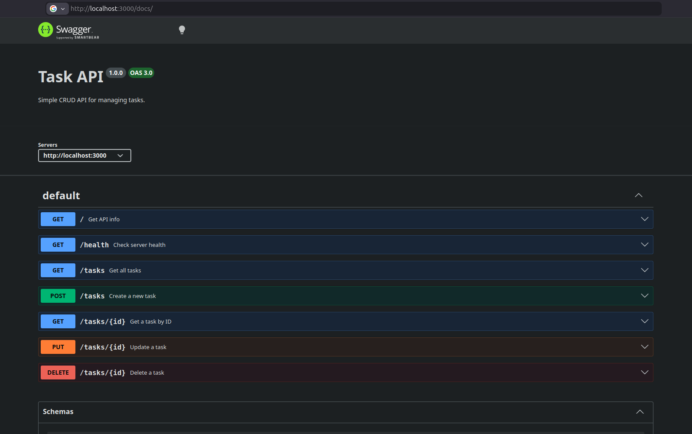
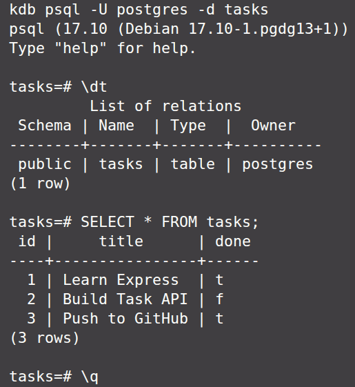

# Task API

A RESTful Task API built with **Node.js, Express, TypeScript, PostgreSQL, Docker, and Supabase Authentication**.

This project demonstrates a complete backend authentication flow, including user signup, login, JWT-based authentication, protected routes, reusable authentication middleware, and logout functionality.

The project was developed progressively through multiple backend engineering stages, focusing on API design, persistence, containerization, authentication, and documentation.

---

## Features

- User signup with Supabase Authentication
- User login with JWT access and refresh tokens
- JWT verification for protected routes
- Reusable authentication middleware
- Protected API endpoints
- Public endpoints
- Swagger API documentation
- PostgreSQL database
- Dockerized application and database

---

## Tech Stack

- **Node.js**
- **TypeScript**
- **Express**
- **PostgreSQL**
- **Docker**
- **Docker Compose**
- **Supabase Authentication**
- **Swagger UI**

---

# Getting Started

## Prerequisites

Make sure you have the following installed:

- Node.js
- Docker
- Docker Compose

You will also need a Supabase project.

---

## Clone the Repository

```bash
git clone https://github.com/alimagdye/a4
cd a4
```

## Environment Variables

Create a `.env` file in the root directory of the project.

You can use `.env.example` as a reference:

```bash
cp .env.example .env
```

Then add your own Supabase credentials.

Example:

```env
DATABASE_URL=your_database_url_here

SUPABASE_URL=your_supabase_url_here
SUPABASE_PUBLISHABLE_KEY=your_supabase_publishable_key_here
```

---

# Running the Project

Start the application using:

```bash
docker compose up --build
```

This command starts the required services and runs the application.

Once the application is running, the API will be available at:

```text
http://localhost:3000
```

---

## Manual Installation

```bash
npm install
```

## Run

```bash
docker start taskdb # db container

npm run dev
```

The server runs at:

```
http://localhost:3000
```

## Swagger Documentation

Swagger UI is available at:

```text
http://localhost:3000/docs
```



Swagger allows you to explore and test the API endpoints directly from your browser.

For protected endpoints:

1. Log in using `/auth/login`
2. Copy the returned `accessToken`
3. Click the **Authorize** button in Swagger
4. Enter the Bearer token
5. Test protected endpoints

---

## Postgres docker

```
docker run --name taskdb \
  -e POSTGRES_PASSWORD=dev \
  -e POSTGRES_DB=tasks \
  -p 5432:5432 \
  -v taskdata:/var/lib/postgresql/data \
  -d postgres:17
```

means:

```
docker run
   │
   ├── name → taskdb
   ├── password → dev
   ├── database name → tasks
   ├── port → 5432
   ├── volume → taskdata (data presistance)
   ├── background → yes
   └── image → postgres (download it if not exist)
```

and

```
docker start taskdb
```

means:

start taskdb container

and

```
docker exec -it taskdb psql -U postgres -d tasks
```

means:

Open an interactive PostgreSQL terminal inside the taskdb Docker container, logged in as the postgres user, connected to the tasks database.

then:

```
SELECT * FROM tasks;
```

### Screenshot



# Authentication Flow

The application uses Supabase Authentication and JWT access tokens.

### Signup

```text
Client
   ↓
POST /auth/signup
   ↓
Supabase Authentication
   ↓
User created
```

### Login

```text
Client
   ↓
POST /auth/login
   ↓
Supabase verifies credentials
   ↓
Access Token + Refresh Token
```

### Protected Routes

Protected endpoints require an Authorization header:

```http
Authorization: Bearer <access_token>
```

The request passes through the reusable authentication middleware:

```text
Request
   ↓
requireAuth Middleware
   ↓
Extract Bearer Token
   ↓
Verify Token with Supabase
   ↓
Attach User to req.user
   ↓
Protected Route
```

Invalid or expired tokens return:

```text
401 Unauthorized
```

---

# Security

The project uses environment variables for sensitive configuration.

The `.env` file is excluded from Git:

```gitignore
.env
```

A `.env.example` file is included so other developers can easily configure their own environment.

Sensitive credentials and Supabase keys should never be committed to a public repository.

---

# Author

**Ali Magdy**

Backend Developer focused on building scalable APIs and backend systems using Node.js, TypeScript, Express, PostgreSQL, and modern backend technologies.
